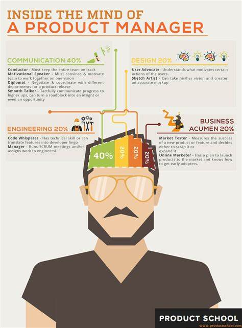

<html>
<head>
	<meta charset="utf-8" />
	<link rel="stylesheet" href="style.css">
</head>
<body>
	<h1>product manager가 되기 위한 준비과정</h1>
	

		<ol>
			<li><a href="군대.html"  class="saw" id="active">군대</a></li>
			<li><a href="워킹홀리데이.html" class="saw">워킹홀리데이</a></li>
			<li><a href="대학교.html">대학교</a></li>
			<li><a href="인턴.html">인턴</a></li>
			<li><a href="기획자.html">기획자</a></li>
			<li><a href="주니어PM.html">주니어PM</a></li>
		</ol>
		
 
		
<strong>Contents</strong>
 
			

				Chapter 01. 군대에서의 고민 
				Chapter 02. 개인정비시간을 활용한 실천체크리스트 
				Chapter 03. 자투리 간 볼거리_PM 관련 아티클, 동영상  
			

		<h2>Chapter 01. 군대에서의 고민</h2>
		

			<h3>1. 인트로<h3>
			MY Dream: <a href="https://madforge50.tistory.com/720">Product manager</a>
			 필요한 역량: 영어의사소통, 커뮤니케이션, 제품 관리, 우선순위, 일정관리, 빠른 학습 등 매우 많다.
			바로 주니어PM이 되는 방법도 있다. 그렇지만 매우 빈약하고 튼실하지 못하다. 보통의 PM모집공고는 웹/앱 서비스 기획경험을 묻고있다.
			또한 여러가지 툴사용과 함께 기본적인 UI/UX기획 및 설계능력을 요구하고있다. 

			출처: https://madforge50.tistory.com/720 현재 나이 22살로 내가 이런 역량들을 쌓아올려 꿈을 이루기 위해선 어떻게 행동해야하는가.  
			1. 영어회화공부( What: 워킹홀리데이, 꾸준한 영어학습_의사소통) 
			2. 소프트스킬( What: 창업경진대회, 사이드 프로젝트, 대외활동, 공모전 등등) 
			3. 지식습득( What: 도서_PM관련 독서, 실무자 하드스킬 관련 도서) 
			4. 전공( What: 개발 능력, 협업프로젝트 등) 
			5. PM부트캠프, 교육과정( What: PM실무자 관련 교육 및 프로그램 수료, PMP자격증) 
			6. 인턴( What: 서비스 기획관련 인턴) 
			7. 정규직( What: 스타트업 IT제품 기획자, 주니어PM으로 커리어 시작) 
			8. 커리어 패쓰( What: 이직을 통한 몸값상승-> 하이레벨 회사 PM) 
			9. 평생학습( What: 스스로를 객관화하여 부족한 스킬들을 빠르고 효율적으로 체화 
			<h3>2. 전공에 대한 의문 제시<h3> 
			[소프트스킬]#더 중요 
			실질적인 제품기획 및 런칭 경험이다.  
			[하드스킬] 
			학과 
			그렇다면 지금 다니고 있는 대학을 다녀야하나? 
			-> 방향성이 맞지 않다.(전자과 위주)  
			다만 전공학습만으로 개발자가 되는 것이 아님을 명심하고
			방학, 스스로의 학습이 매우 중요하다는 사실을 항상 인지해야 한다.
			(코딩 동아리, IT해커톤)  
			<h3>3. product manager이 되기 위한 Degree<h3> 
			신입PM이 되기위한 역량들을 배울 수 있는 대학교를 중점으로 리서치  
			현) 금오공대 메디컬IT융합공학 
			-> CS조금 + 전자(위주 
			-> 전자를 배우는 것이 나에게 도움이 될까 
			-> 짬뽕이다. 도망치자  
			
			<h2>Chapter 02. 개인정비시간을 활용한 실천체크리스트</h2>
			<input type="checkbox" name="check" value="list1" checked="on">생활코딩  
			<input type="checkbox" name="check" value="list2" checked="on">영어회화_3030잉글리시, 크리에이티브 잉글리시  
			<input type="checkbox" name="check" value="list3" checked="on">헬스  
			<input type="checkbox" name="check" value="list4">독서  
			<input type="checkbox"><input type="text" size=100 value="input text">  
			<input type="checkbox"><input type="text" size=100 value="input text">  
			<input type="checkbox"><input type="text" size=100 value="input text">  
			<input type="checkbox"><input type="text" size=100 value="input text">  
			<input type="checkbox"><input type="text" size=100 value="input text">  
			<h2>Chapter 03. 자투리 간 볼거리_PM 관련 아티클, 동영상</h2>
		
    • 프로덕트 매니저(PM)란?

프로덕트를 성공으로 이끌기 위해 모든 팀을 지휘하는 역할

 

• 일 잘하는 Product manager의 주요 가치

 

1. 사용자를 사랑하고, 

2. 옳은 일을 하고, 

3. 토론하고, 

4. 결과를 소유하고, 

5. 빠른 결정을 내리고, 

6. 매일 더 나아지자.

 

• PM 채용공고_ 자격요건/우대사항

 

 pm 및 서비스 기획 경험

(or ux리서처/그로스해커)

커뮤니케이션

 

서비스에 맞는 유저 데이터 측정 도구를 원활하게 사용할 수 있는 역량(예: Google Tag Manager)을 보유하셨다면 더 좋습니다.

 

• PM 채용공고_ 우대 전공(사용자 경험/데이터 분석)

 

디자인, hci, 산업공학, 심리, 통계

 

컴퓨터과학, 경험디자인,경영, 

 

산업디자인

 

서비스 디자인

 

(ux 및 제품 관련 분야)

 

 

 

 

 

• PM역량

 

[Strategic Thinking]

 

: 점점 더큰 문제 및 제품 영역에 대한 해답을 이끌어 낼 수 있는 능력, 그에 상응하는 내부 사고 리더십

 

_브레인 스토밍, 사고 구조화, 전략 추진, 전문가가 되기

 

 

 

[Communication]

 

: 더 크고 높은 스테이크 청중에게 명확한 서명 및 구두 의사소통.

 

_명확한 이메일 작성, 직접 명확하게 의사소통, 글쓰기 및 프리젠테이션 제공

 

 

 

[Collaboration]

 

: 점점 더 많은 촉진과 팀 내부 및 팀 전체의 다른 사람들과 함께 일을 처리하기.

 

_적극적으로 회의에 참여하고, 회의를 이끌고, 분대 프로세스를 실행하고, 다른 분대와의 문제를 해결하고, 갈등을 적절하게 피하고 확산시킵니다.

 

 

 

[Technicals]

 

: 제품 관리 및 파트너 기능(엔지니어링, 디자인)도구를 사용하여 팀 전체에서 잘 협력합니다.

 

_이야기 작성, 분석 수행, 프로토타입 구축 , 

 

SEO(검색엔진 최적화이해

 

 

 

[Details & Quality]

 

: 증가하는 범위에서 결과를 이끌어 내고 실수를 포착합니다._사용 사례와 함께 명확한 사양을 작성하고, 제 시간에 작고 큰 제품을 제공하고 버그가 거의 없으며, 도로의 충돌을 처리하기 위한 옵션을 탐색하여 결과를 달성합니다.

 

 

 

[User Science & Empathy]

 

: 사용자 과학 툴킷을 마스터하여 사용자를 더 잘 이해하고 사용자의 요구와 행동에 맞게 제품을 조정합니다._설문조사, 인터뷰, 프로토타이핑, A/B테스트 및 분석 도구를 성공적으로 수행하고, 다양한 사용자 유형과 요구 사항을 이해하고 표현하며, 사용자 과학을 통찰력으로 종합하는 것이 포함됩니다.

 

 

 

[Management]

 

: 사람과 조직을 성공적으로 성장시킵니다._멘토링, 관리, 성장하는 팀 및 성장하는 조직이 포함됩니다.

 

 

 

 

 

 

 

• 미래를 위한 러닝커브 향상 비법 ✍️

 

 

 

나만의 로드맵을 만들어 단계별 공략 계획을 세워봐요.

 

공부한 내용을 블로그 등을 통해 다른 사람과 공유하고 피드백을 받아요.

 

 

 

 

 

 

 

• PM이 되기 위한 커리어 테크

 

-->>> 즉 어떤 분야에서 강점이 있는 PM이 될것인가를 항상 염두해야함. T자형 직무

 

 

 

1)

 

주니어 기획자 -> 3~4년 기획자 -> 주니어PM

 

-> 시니어 PM -> VP_PM

 

 

 

 

 

 

 

#•주니어 기획자 준비사항 

 

 

 

<UX>_사용자 이해, 디자인 관점에서의 프로덕트 구현과정 이해하기 위해 필요

 

 

 

서비스 디자인수업

 

 

 

<프로그래밍 언어>(SQL, HTML/CSS, Ptyhon)

 

_개발자와 원할한 커뮤니케이션을 할때 도움. 진입장벽이 높아 굉장히 매력적. 구현보다는 큰 구조를 잘 잡을 수 있는 기획자가 되기 위해서라는 측면에서 접근하는 것이 좋다.

 

_데이터 처리/분석

 

_기술적 프로세스 이해

 

 

 

<툴 공부>

 

(필: PPT, 추: APP기획-> sketch 또는 Adobe XD/ WEB 기획- Axure, 권: inVision, Protopie, Figma 등의 각종 프로토타이핑 툴, Photoshop 등 비주얼 중심의 툴) 

 

 

 

<기획 공부>

 

 

 

서비스 디자인를 처음부터 끝까지 만들어보는 수업(풀사이클 중요)

 

 

 

 

 

'스토리로 이해하는 ux디자인 프로세스'

 

 

 

역기획서(기획안, 화면설계서)

 

 

 

포토폴리오

 

 

 

기획자가 뭘해야하는지에 대한 이해 및 정리

 

 

 

 

 

<직무 공부>

 

#브런치#채용공고#책읽기#직무인터뷰읽기

 

 

 

책추천: 프로덕트 오너, 인스파이어드, 도그냥 서비스 기획 스쿨

 

 

 

 

 

브런치

 

https://todaygnimaerd.tistory.com/26

 

 

 

https://brunch.co.kr/@hero4earth/7

 

 

 

https://brunch.co.kr/@cysstory/164?fbclid=IwAR2GZjfxJkOIpEk7Pi9m9TKD4l20NQCszYh-uE2kbenSB7GgtFjMATx9l7g

 

 

 

https://todaygnimaerd.tistory.com/50

 

 

 

https://brunch.co.kr/@jjollae/24

 

 

 

 

 

아티클

 

 

 

[https://medium.com/agileinsider]

 

 

 

https://medium.com/agileinsider/product-manager-skills-by-seniority-level-a-deep-breakdown-cd0690f76d10

 

 

 

https://medium.com/agileinsider/product-management-starter-kit-books-and-blogs-you-need-to-know-e17c179ec911

 

 

 

<평소 서비스에 관심 가지는 습관>

 

_갑자기 키울 수 없는 인사이트를 키우기 위해 필요.

 

평소에도 새로 나온 앱을 다운받아 이용해보는 습관.

 

프로불편러면 너무 좋다, 고객 리뷰나 개선점 캐치해 정리-> 역 기획, UI/UX개선

 

 

 

 

 

 

 

 

 

<주요 마인드>

 

"프로불편러"

 

-> 이용 중 개선점 찾기, 개선해내고 싶은 성향

 

"꼼꼼함"

 

 

 

 

 

 

 

2)_ 경험너무 부족

 

APM -> 주니어PM -> 시니어PM->VP_PM

 

 

 

 

 

3)

 

주니어개발자 -> 3~4년 개발자 -> 주니어PM

 

-> 시니어 PM -> VP_PM

 

 

 

 

 

 

 

개발 중심 PM을 위한 아티클_프로젝트 매니저

 

https://www.thisisgame.com/webzine/gameevent/nboard/227/?n=93530
	

</body>
<html>
